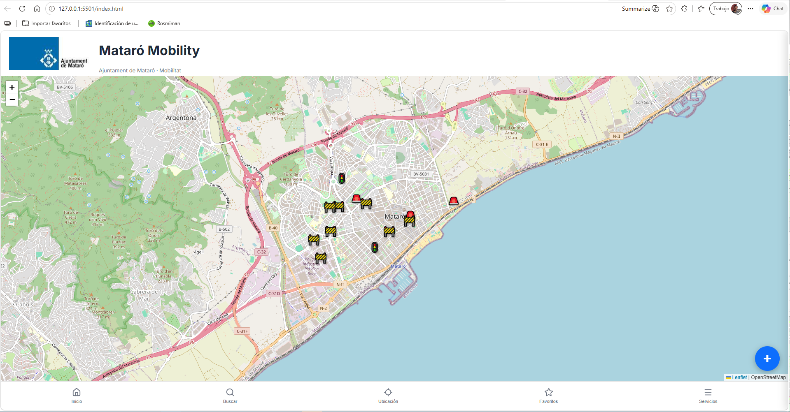

# 🚦 Mataró-Mobility




> **Estado del proyecto:** 🟢 En desarrollo activo
>
> Aplicación web para la gestión, consulta y visualización de información relacionada con la movilidad urbana del municipio de Mataró mediante un mapa interactivo.

---

## 📑 Índice

- [📋 Descripción](#-descripción)
- [⭐ Características principales](#-características-principales)
- [✨ Funcionalidades](#-funcionalidades)
- [🛠 Tecnologías utilizadas](#-tecnologías-utilizadas)
- [📂 Estructura del proyecto](#-estructura-del-proyecto)
- [📚 Documentación](#-documentación)
- [📸 Capturas de pantalla](#-capturas-de-pantalla)
- [🚀 Inicio rápido](#-inicio-rápido)
- [🚧 Estado del proyecto](#-estado-del-proyecto)
- [👨‍💻 Autor](#-autor)
- [📄 Licencia](#-licencia)

---

# 📋 Descripción

**Mataró-Mobility** es una aplicación web desarrollada para centralizar la información relacionada con la movilidad urbana del municipio de Mataró.

Su objetivo es ofrecer una herramienta sencilla, visual e intuitiva que permita consultar sobre un mapa interactivo los principales servicios de movilidad, incidencias y recursos municipales, facilitando la gestión y la toma de decisiones.

La aplicación está diseñada para ser modular, fácilmente ampliable y basada en datos almacenados en formato JSON.

---

# ⭐ Características principales

- 🗺️ Mapa interactivo.
- 🚧 Gestión de incidencias.
- 🚗 Consulta de aparcamientos.
- 🚕 Información sobre paradas de taxi.
- 🚲 Aparcamientos para bicicletas.
- 🏍️ Aparcamientos para motocicletas.
- ♿ Plazas de movilidad reducida (PMR).
- 📍 Marcadores personalizados.
- 📄 Datos en formato JSON.
- 📱 Diseño adaptable (Responsive).

---

# ✨ Funcionalidades

| Funcionalidad | Estado |
|---------------|:------:|
| 🗺️ Mapa interactivo | ✅ |
| 📍 Marcadores personalizados | ✅ |
| 🚗 Aparcamientos | ✅ |
| 🚕 Paradas de taxi | ✅ |
| 🚲 Aparcamientos para bicicletas | ✅ |
| 🏍️ Aparcamientos para motocicletas | ✅ |
| ♿ Plazas PMR | ✅ |
| 🚧 Gestión de incidencias | ✅ |
| 📄 Datos JSON | ✅ |
| 📱 Diseño responsive | ✅ |
| 🎨 Iconografía personalizada | ✅ |

---

# 🛠 Tecnologías utilizadas

| Tecnología | Descripción |
|------------|-------------|
| HTML5 | Estructura de la aplicación |
| CSS3 | Diseño y estilos |
| JavaScript (ES6) | Lógica de la aplicación |
| JSON | Almacenamiento de datos |
| Git | Control de versiones |
| GitHub | Repositorio y colaboración |
| Visual Studio Code | Entorno de desarrollo |

---

# 📂 Estructura del proyecto

```text
Mataro-Mobility
│
├── assets
│   ├── css
│   │   └── style.css
│   │
│   ├── data
│   │   ├── incidencias.json
│   │   └── services.json
│   │
│   └── js
│       ├── app.js
│       ├── incidents.js
│       ├── incidentsUI.js
│       ├── maps.js
│       ├── providers.js
│       ├── services.js
│       ├── storage.js
│       └── ui.js
│
├── docs
│   ├── CHANGELOG.md
│   ├── DECISIONS.md
│   ├── MANUAL_TECNIC.md
│   ├── MANUAL_USUARI.md
│   ├── PROJECT_STATE.md
│   └── TODO.md
│
├── icons
│
├── images
│   ├── LOGO.png
│   └── screenshot.png
│
├── .gitignore
├── index.html
└── README.md
```

---

# 📚 Documentación

La documentación del proyecto se encuentra en la carpeta **docs**.

| Documento | Descripción |
|-----------|-------------|
| 📖 [Manual de Usuario](docs/MANUAL_USUARI.md) | Guía de utilización de la aplicación |
| 🔧 [Manual Técnico](docs/MANUAL_TECNIC.md) | Arquitectura y funcionamiento interno |
| 📋 [Estado del Proyecto](docs/PROJECT_STATE.md) | Situación actual del desarrollo |
| 📝 [Registro de Cambios](docs/CHANGELOG.md) | Historial de modificaciones |
| 💡 [Decisiones de Diseño](docs/DECISIONS.md) | Criterios técnicos adoptados |
| ✅ [Lista de tareas](docs/TODO.md) | Mejoras previstas y tareas pendientes |

---

# 📸 Capturas de pantalla

### Pantalla principal

La aplicación presenta toda la información sobre un mapa interactivo.


---

# 🚀 Inicio rápido

## Requisitos

- Navegador web moderno.
- Visual Studio Code (recomendado).

## Clonar el repositorio

```bash
git clone https://github.com/Mobilitat2026/Mataro-Mobility.git
```

## Abrir el proyecto

```bash
cd Mataro-Mobility
```

## Ejecutar

Se recomienda utilizar la extensión **Live Server** de Visual Studio Code.

Una vez instalada:

1. Abrir la carpeta del proyecto.
2. Hacer clic derecho sobre `index.html`.
3. Seleccionar **Open with Live Server**.

La aplicación se abrirá automáticamente en el navegador.

---

# 🚧 Estado del proyecto

El proyecto se encuentra actualmente en fase de desarrollo activo.

Las funcionalidades principales están implementadas y el desarrollo continúa incorporando nuevas mejoras relacionadas con la movilidad urbana, la gestión de incidencias y la integración de nuevos servicios.

---

# 👨‍💻 Autor

**Mobilitat2026**

Proyecto desarrollado como plataforma para la gestión y consulta de la movilidad urbana de Mataró.

---

# 📄 Licencia

Actualmente este proyecto **no dispone de una licencia pública**.

Todos los derechos reservados © Mobilitat2026.

## Servicios Municipales

Mataró Mobility permite visualizar mapas oficiales de Google My Maps directamente desde la aplicación.

Actualmente incorpora:

- CID
- PMR
- Bicicletes

La configuración se realiza desde:

assets/data/services.json

Cada servicio dispone de:

- nombre
- icono
- categoría
- URL del mapa